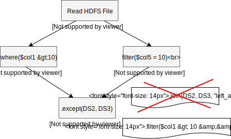

Spark community decided to replace Except logical operator using left anti-join in [SPARK-12660](https://issues.apache.org/jira/browse/SPARK-12660).
It facilitates to take advantage of all the benefits of the join operations such as managed memory, 
code generation and broadcast joins, cc. [SPARK-12660](https://issues.apache.org/jira/browse/SPARK-12660).

Except is one of the mostly used logical operator that is mainly used to get the difference between 
the two datasets. More often (not always), we happen to use except on two different datasets 
that are derived/ transformed from a single parent dataset. If two datasets parent relations (say., 
HDFS File) are same and one or both of the datasets (on which we need to run apply except) are purely 
transformed using filter operations, then instead of rewriting the Except operator using expensive 
join operation, we can rewrite it using cheaper filter operation. I will discuss the details of this 
rule in the blog post. If you are not already familiar with the internals of spark catalyst and 
it's Tree Node structure and query optimization refer my previous post [here]() before continuing 
with this post.

## Quick Example

Case 1:
<center>



</center>

Case 2:
<center>


</center>

## Except Construct

Except operation takes two datasets d1 and d2 and returns a resulting dataset with the rows that don't
appear in the second dataset. In order to compare the tuples from the two datasets both the datsets 
should contains same number of columns/ fields or at least has to be projected in that way. There are 
two types of except operation based on whether to remove duplicates or not.

### Except All
Don't remove duplicates

### Except Distinct
Which removes duplicates

In spark there is no such distinction between Except All and Except Distinct, there is only one operator names
Except which actually behaves as Except Distinct.

## Anti Join Construct
Anti join is a better way of doing queries that is used to be doing using NOT IN or NOT EXISTS operator. 
The performance benefits of using anti join over NOT IN or NOT Exists operator is similar to performance
of Nested loop join over Hash join. You can read more about it at this link.
Eg: 
```sql
select * from table1 t1 where not exists (select 1 from table2 t2 where t1.id = t2.id)
```

Anti join don't remove the duplicates, so the results of a query using anti join will be same as that of the 
results of the of the Except All operator.

## Distinct Construct
Distinct operation removes duplicate tuples in a dataset. In order to do this spark does Hash partitioning
on the dataset using all the columns of the dataset as the partitioning key and uses hash code of the 
tuples for removing the duplicates. Partitioning moves the data across the nodes, which is technically 
expensive than doing an anti join operation using broadcast hash join.

## Spark Optimizer
Ok enough of the theory let's take a look at some code from the spark codebase.

Below is a snippet from spark Logical query optimizer: `org.apache.spark.sql.catalyst.optimizer.Optimizer`

```scala
::
    Batch("Replace Operators", fixedPoint,
      ReplaceIntersectWithSemiJoin,
      ReplaceExceptWithAntiJoin,
      ReplaceDistinctWithAggregate) 
::      
``` 

And here is the actual `ReplaceExceptWithAntiJoin` Rule implementation.

```scala
object ReplaceExceptWithAntiJoin extends Rule[LogicalPlan] {
  def apply(plan: LogicalPlan): LogicalPlan = plan transform {
    case Except(left, right) =>
      assert(left.output.size == right.output.size)
      val joinCond = left.output.zip(right.output).map { case (l, r) => EqualNullSafe(l, r) }
      Distinct(Join(left, right, LeftAnti, joinCond.reduceLeftOption(And)))
  }
}
```

By seeing these code, it's tempted me to write a rule called `ReplaceExceptWithNotFilter` and schedule
the Rule just before the `ReplaceExceptWithAntiJoin` rule and check what happens. Here is my code,
it's not necessarily to be perfect as it is not meant to be used in production.

```scala
::
    Batch("Replace Operators", fixedPoint,
      ReplaceIntersectWithSemiJoin,
      ReplaceExceptWithNotFilter,
      ReplaceExceptWithAntiJoin,
      ReplaceDistinctWithAggregate) 
::      
``` 

```scala
object ReplaceExceptWithNotFilter extends Rule[LogicalPlan] {

  def isEligible(left: LogicalPlan, right: LogicalPlan): Boolean = {
    right.nodeName == "Filter" && 
      right.asInstanceOf[Filter].child.canonicalized.fastEquals(left.canonicalized)
  }

  def replaceAttributeRef(condition: Expression, leftChild: LogicalPlan): Expression = {

    condition transform {
      case AttributeReference(name, _, _, _) =>
        leftChild.output.find(_.name == name).get
    }
  }

  def apply(plan: LogicalPlan): LogicalPlan = {
    plan transform {
      case Except(left, right) if isEligible(left, right) =>
        Distinct(
          Filter(Not(replaceAttributeRef(right.asInstanceOf[Filter].condition, left)), left)
        )
    }
  }
}
```

I tested the code on a csv file of size 500 Mb using couple of quick queries something as follows:
 
 ```bash
 val ds1 = spark.read.option("header", "true").csv("path/to/the/dataset")
 val ds2 = ds.where($"month" === 12)
 val ds3 = ds.where($"month" < 12)
 val ds4 = ds3.except(ds2)
```

And when i verified the optimized plan via `ds4.queryExecution.optimizedPlan.numberedTreeStringd`, 
the plan is changed 

from:
to:
```sql
00 Aggregate [...]
01 +- Join LeftAnti, (...)
02    +- Relation[...]
```


to:
```sql
00 Aggregate [...]
01 +- Filter ((isnotnull(month) && (cast(month as int) < 3)) && NOT (cast(month as int) = 12))
02    +- Relation[...]
```

And i found the new rule `ReplaceExceptWithNotFilter` gave a good performance gain. The same query 
that took around 60 seconds is reduced to 26 seconds with the addition of the new rule. My immediate 
thought was when there is 120% latency gain on a single node instance where is no actual shuffling involved, 
there should be a much better performance gain in a big cluster. So i wanted add this new rule to the
spark Optimizer via `ExperimentalMethods` that is available since spark 2.0 [Ref]().

But i found out the new rule is never applied by the spark optimizer. When i did some debugging, i found the
extra optimizations added via `ExperimentalMethods` are applied only after all the bathches of predefined 
rules applied. So by the time the extra optimization is scheduled to apply, the `Except` operator is 
already replaced with `Anti-Join` by the predefined rules. It would have been helpful if the 
`ExperimentalMethods` class provides option to add some pre-optimization rules here. I will discuss 
how to make this option available in the [next post]().

So now the only way to test the performance difference is to rent some machines from amazon aws, and
deploy Hadoop, Spark with my modifications and upload a very big file to the HDFS. OR.. There is an easier
way, we could write a custom rule to rewrite the anti join using not filter :)

Here is that custom rule:

```scala
object ReplaceAntiJoinWithNotFilter extends Rule[LogicalPlan] {
  def isEligible(left: LogicalPlan, right: LogicalPlan, joinType: JoinType): Boolean = {
    joinType.sql == "LEFT ANTI" && right.nodeName == "Filter" &&
      right.asInstanceOf[Filter].child.canonicalized.fastEquals(left.canonicalized)
  }

  def replaceAttributeRef(condition: Expression, leftChild: LogicalPlan): Expression = {
    condition transform {
      case AttributeReference(name, _, _, _) =>
        leftChild.output.find(_.name == name).get
    }
  }

  override def apply(plan: LogicalPlan) = {
    plan transform {
      case Join(left, right, joinType, cond) if isEligible(left, right, joinType) =>
          Filter(Not(replaceAttributeRef(right.asInstanceOf[Filter].condition, left)), left)
    }
  }
}
```

One of the limitations of applying the custom rule at the end is that the custom rule won't be subjected
to any further optimization by some of the predefined rules. For example, when i scheduled to apply the 
`ReplaceExceptWithNotFilter` rule just before the `ReplaceExceptWithAntiJoin` rule in the "Replace Operators" 
batch, the filter operator is further optimized

from:
```sql
01 +- Filter NOT (isnotnull(month) && (cast(month as int) = 12))
02    +- Filter (isnotnull(month) && (cast(month as int) < 3))
```

to:
```sql
01 +- Filter ((isnotnull(month) && (cast(month as int) < 3)) && NOT (cast(month as int) = 12))
```

This optimization rule is called `CombineFilters`, in order to achieve this we should include it in 
our `ReplaceAntiJoinWithNotFilter` rule or we can also pass the `CombineFilters` optimization rule 
via `ExperimentalMethods` in addition to our custom rule.


